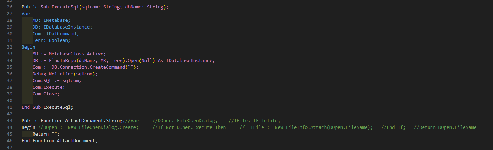

# fore highlight

данный проект -- синтаксическая подсветка проприетарного языка fore, на данный момент в разработке.

### requirements
1. установите node.js
2. установите yarn
3. npm install -g vsce

## суть проекта

проект представляет из себя наработки расширения для vs code, позволяющего использовать синтаксическую подсветку кода на языке fore.

проект является форком [pascal language basics](https://github.com/AnsonYeung/vscode-pascal-language-basics) для подсветки кода на паскале.

на данный момент расширение работает для файлов .fore и .text, изменить это можно в package.json (вроде)

## принцип работы

проект имеет 3 основных файла:
- package.json
    - данный файл представляет из себя файл с настройками расширения и скриптами для yarn
- fore.tmLanguage.yaml
    - данный файл представляет из себя разметку кода в формате yaml для регулярных выражений. на данный момент реализована поддержка подсветки начала и конца объявления классов и процедур
- fore.tmLanguage.json
    - данный файл появляется после компиляции в json второго и используется расширением для подсветки

В vs code следующий алгоритм подсветки:
1. ищется первый попавшийся подходящий паттерн из fore.tmLanguage.yaml: patterns (начало на линии 3 на текущий коммит)
2. в fore.tmLanguage.yaml: repository (линия 49) ищется этот паттерн. он может быть однострочным, т.е. располагаться на части строки (например комментарий //) либо быть многострочным (объявление процедуры). В первом случае элемент имеет ключ match на первом уровне вложенности, во втором -- begin и end. также элемент может иметь ключ patterns, в этом случае туда можно добавить ссылки на другие паттерны, поиск которых будет производиться внутри текущего элемента. e.g. если нам нужно чтобы комментарий также раскрашивался внутри объявления процедуры, то в её patterns нужно указать паттерн комментария. 
3. содержимое match, begin, end представляет из себя паттерны regex в диалекте oniguruma, рекомендую отлаживать выражения в (данном сервисе)[https://regex101.com/r/LNJph8/1] в диалекте pcre (они похожи).
4. элементы с разным значением name будут раскрашены по-разному 

## установка расширения

для того, чтобы не устанавливать скомпилированное в vsix расширение каждый раз через gui, я написал несколько скриптов. 
перед началом работы выполните на валидном проекте следующие действия:
~~~sh
yarn
yarn prepare
vsce package
yarn ins
~~~

после этого команда yarn i будет автоматически компилировать расширение и переустанавливать его в ваш vs code.
